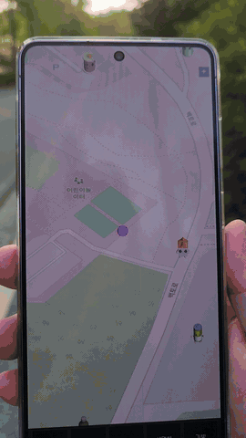
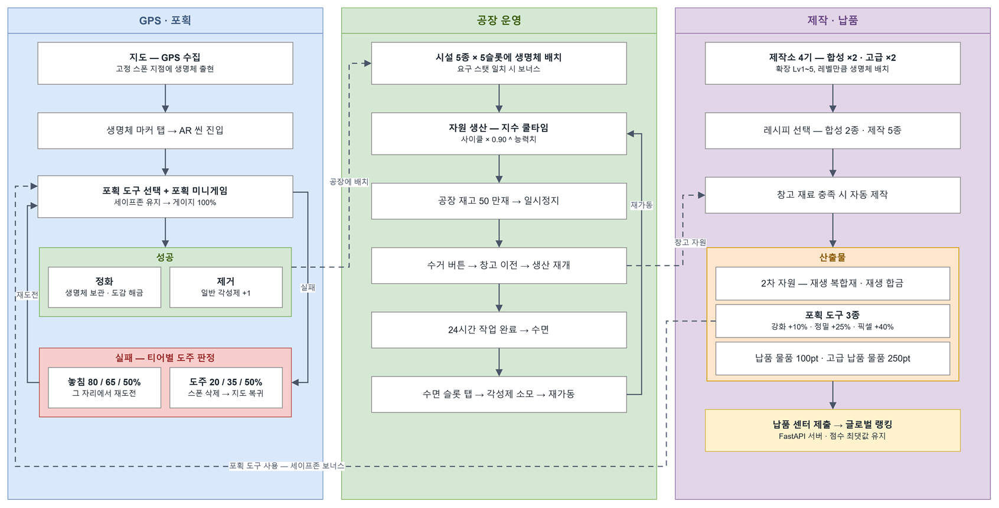
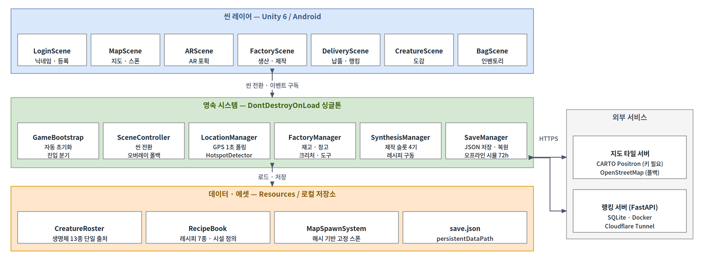

# Pixel Cleaners

**AR 플로깅 타이쿤 게임** — 현실 속 쓰레기를 포획하고, 자원으로 되살린다.

GPS 핫스팟에 들어가면 지도에 오염 생명체가 나타납니다. 탭하면 AR 씬에서 포획 미니게임을 하고,
포획한 생명체를 공장에 배치해 쓰레기를 자원으로 정제·합성합니다. 완성한 납품 물품을 제출해 글로벌 랭킹을 겨룹니다.

<p align="center"></p>

## 프로젝트 정보

| 항목 | 내용 |
|------|------|
| 팀 구성 | 학생 3인 + 지도교수 1인 (총 4인) |
| 담당 역할 | 리드 개발 — 클라이언트 핵심 루프(GPS → AR 포획 → 공장 → 납품), 글로벌 랭킹 서버 |
| 관련 논문 | 「메타 SW 기반 AR 플로깅 게임 콘텐츠 개발에 관한 연구」 (공저 4인, 지도교수 포함) |
| 발표 | 2026 KIIT 하계 종합학술대회 특별세션 |

## 게임 루프



```
닉네임 등록 → GPS 핫스팟 진입 → 지도에 생명체 스폰
→ AR 씬에서 포획 미니게임 → 정화(보관) / 제거(각성제)
→ 공장에 배치 → 자원 생산 → 제작 → 납품 물품
→ 납품 → 글로벌 랭킹
```

## 시스템 구조



## 주요 기능

- **위치 기반 스폰** — 격자 + 시간 해시로 모든 플레이어에게 같은 스폰을 서버 없이 재현
- **AR 포획 미니게임** — 터치 드래그·중력센서로 세이프존 유지, 도구 4종, 희귀도 5단계
- **자원 생산·제작** — 생명체 13종, 시설 5종 + 제작소 4기, 지수형 쿨타임 `baseCycle × 0.90^statPower`
- **영속성** — JSON 자동 저장, 재접속 시 최대 72시간 오프라인 생산 시뮬레이션
- **글로벌 랭킹 서버** — FastAPI, 토큰 인증, 경쟁 순위, 이벤트 기간 랭킹

## 기술 스택

| 구분 | 내용 |
|------|------|
| 클라이언트 | Unity 6 (6000.3.11f1), C#, URP, Input System |
| AR | AR Foundation 6.3.3 + ARCore |
| 플랫폼 | Android 7.0+ (API 24), IL2CPP, ARM64 |
| 지도 | Unity Location Service + CARTO / OpenStreetMap 타일 |
| 서버 | FastAPI, SQLAlchemy(async), SQLite, Docker, Cloudflare Tunnel |

## 저장소 구조

```
client/   Unity 프로젝트
server/   FastAPI 랭킹 서버
docs/     기술 문서, API 명세, 흐름도 이미지
```

## 문서

- [`docs/ARCHITECTURE.md`](docs/ARCHITECTURE.md) — 클라이언트 구조, 핵심 로직, 설계 판단, 해결한 문제
- [`docs/API.md`](docs/API.md) — 랭킹 API 명세
- [`server/README.md`](server/README.md) — 서버 구조, 실행, 설계 노트
## 실행

1. Unity 6000.3.11f1로 `client/`를 엽니다. 아래 UI 에셋 팩을 먼저 임포트해야 합니다.
2. `client/ServerConfig.example.json`을 `client/Assets/Resources/ServerConfig.json`으로 복사해 서버 주소를 넣습니다.
3. 메뉴 `PixelCleaners → 씬 생성` 후 `PixelCleaners → 테스트 APK 빌드`.

에디터에서는 GPS Mock(서울시청 좌표)으로 동작합니다. 서버 실행은 [`server/README.md`](server/README.md)를 참고하세요.

## 외부 에셋 (미포함)

UI는 itch.io의 [Pixel UI & HUD Pack](https://deadrevolver.itch.io/pixel-ui-hud-pack) (Dead Revolver)을 사용했습니다.
유료 에셋이라 저장소에 포함하지 않았으며, 임포트 전에는 `PixelUI`를 참조하는 스크립트에서 컴파일 오류가 납니다.

## 남은 과제

- 클라이언트에 서버 토큰 인증 연동
- QR 플로깅 인증
