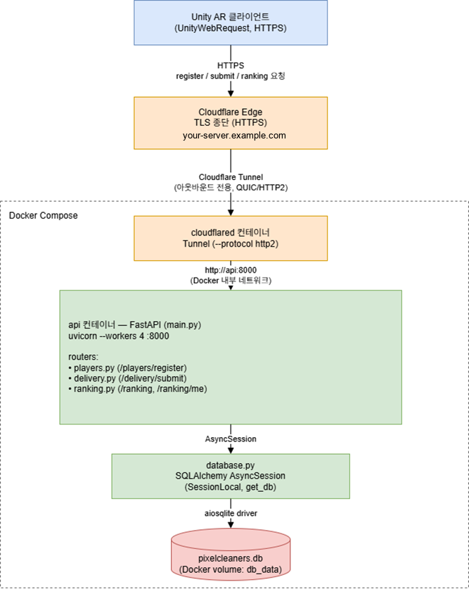

# Pixel Cleaners — 랭킹 서버

Unity 클라이언트의 납품 점수를 집계하는 REST API입니다.
FastAPI + SQLAlchemy(async) + SQLite로 만들고, Docker Compose와 Cloudflare Tunnel로 배포합니다.
API 명세는 [`../docs/API.md`](../docs/API.md)에 있습니다.



## 구조

```
main.py           앱 생성, 라우터 등록, 기동 시 테이블 생성·마이그레이션, /health
config.py         환경변수 → 설정값
database.py       엔진/세션, SQLite PRAGMA, 마이그레이션
models.py         Player, DeliveryRecord, DeliverySubmission, Event
auth.py           제출 토큰 검증
ranking_core.py   랭킹 계산 공통 로직
routers/          players, delivery, ranking, events
scripts/          운영 스크립트 (테스트 계정 정리, 이벤트 관리)
tests/            검증 스크립트 (임시 DB 사용)
```

| 테이블 | 성격 |
|--------|------|
| `players` | 기기당 1행, 제출 토큰 보관 |
| `delivery_records` | 플레이어당 1행, 최고점만 — 상시 랭킹 |
| `delivery_submissions` | append-only 제출 이력 — 이벤트 집계, 이상 점수 추적 |
| `events` | 이벤트 정의 |

## 실행

```bash
cp .env.example .env          # 값 채우기 (.env는 커밋하지 않음)
docker compose up -d --build
curl -s http://localhost:8000/health
```

| 환경변수 | 기본값 | 설명 |
|---------|-------|------|
| `DATABASE_URL` | SQLite 파일 | PostgreSQL로 교체 가능 |
| `CLOUDFLARE_TUNNEL_TOKEN` | — | 터널 토큰 (비밀값) |
| `AUTH_ENFORCE` | `false` | `false`면 토큰 검증 실패를 경고만, `true`면 401/403 |
| `POINTS_PER_ITEM` | `100` | 점수 단위. 클라이언트와 같아야 함 |
| `RANKING_EXCLUDE_PREFIXES` | — | 랭킹에서 숨길 `device_id` 접두사 (리허설 계정용) |
| `SCORE_RATE_LIMIT_PER_HOUR` | `30000` | 시간당 증가분이 넘으면 경고 로그 |

## 테스트

```bash
python -m venv .venv && .venv/bin/pip install -r requirements-dev.txt
PYTHON=.venv/bin/python tests/run_all.sh
```

| 스크립트 | 검증 대상 | 건수 |
|---------|----------|-----|
| `smoke_test.py` | API 계약, 랭킹·인증·이벤트 동작 | 41 |
| `migration_test.py` | 구 스키마 DB 마이그레이션, 데이터 보존, 구버전 클라이언트 호환 | 19 |
| `concurrency_test.py` | 동시 제출, 리허설 계정 필터, 이벤트 집계 경계 | 9 |

---

## 설계 노트

### 랭킹에서 "내 줄" 찾기

응답에 식별자가 없어 클라이언트가 점수+닉네임으로 자기 줄을 추측했고, 동점자나 동명이인에서 틀렸습니다.
`RankEntry`에 `player_id`를 넣으면 간단하지만, 상위 플레이어의 `player_id` 목록이 그대로 노출됩니다.
대신 조회자가 자기 id를 `?me=`로 넘기면 서버가 해당 줄에 `is_me: true`를 붙이고, 내 순위를 `me` 블록으로 함께 돌려줍니다.
기존 클라이언트는 그대로 동작하고, 호출도 2회에서 1회로 줄었습니다.

### 순위 계산 통일

목록은 행 순번을, 내 순위와 제출 응답은 경쟁 순위를 써서 같은 플레이어가 2위와 1위로 다르게 보였습니다.
세 엔드포인트를 경쟁 순위로 통일해 `ranking_core.py`에 모았고, 목록은 `RANK() OVER` 윈도우 함수로 계산합니다.
점수가 100 단위라 동점이 많아 `score DESC, updated_at ASC, player_id ASC`로 정렬을 고정했습니다(먼저 도달한 사람이 위). 페이징 중복·누락이 사라졌습니다.

### 인증을 단계적으로 켜기

토큰 검증을 바로 강제하면 업데이트하지 않은 클라이언트의 제출이 전부 실패합니다.
`AUTH_ENFORCE`로 경고 모드와 강제 모드를 나눠, 로그로 구버전 비율을 확인한 뒤 전환합니다.
단일 인스턴스라 JWT의 무상태 이점이 없어, 계정별로 즉시 폐기할 수 있는 DB 저장 랜덤 토큰을 택했습니다.

### 이벤트 배율을 곱하는 위치

클라이언트는 누적 총점을 보내고 서버는 최댓값을 유지합니다. 저장값에 배율을 곱하면 이벤트가 끝난 뒤에도 부풀린 점수가 남습니다.

```
상시 랭킹 점수   = 제출된 누적 총점의 최댓값     ← 배율 미적용
이벤트 랭킹 점수 = SUM(기간 내 증가분) × 배율    ← 배율은 여기만
```

기존 데이터에는 최고점만 있어 기간 내 증가분을 계산할 수 없었기 때문에, append-only 제출 이력 테이블을 추가했습니다.
기간 판정은 서버가 하고, 응답에 `server_time`을 함께 보내 클라이언트가 서버 시각 기준으로 카운트다운합니다.

### SQLite와 워커 수

`--workers 4` + 단일 SQLite 파일 구성은 제출이 몰리면 `database is locked`로 500이 났습니다.
워커를 1개로 고정하고 WAL 모드와 `busy_timeout`을 켰습니다. 비동기 FastAPI라 이 규모에서는 충분하며,
동시 제출 200건 + 동시 조회 30건으로 확인했습니다. 트래픽이 커지면 워커를 늘리기 전에 PostgreSQL로 옮깁니다.

### 관리자 API를 만들지 않은 이유

테스트 계정 삭제·랭킹 초기화 API를 요청받았지만, 한 번에 랭킹 전체를 지울 수 있는 경로를 인터넷에 두지 않기로 했습니다.
대신 서버에서만 실행하는 정리 스크립트(기본 dry-run)와, 리허설 계정을 애초에 랭킹에서 숨기는 `RANKING_EXCLUDE_PREFIXES`를 두었습니다.
SQLite는 기본적으로 외래 키를 강제하지 않아, 정리 스크립트는 자식 테이블부터 지웁니다.

### 마이그레이션

`create_all()`은 기존 테이블에 컬럼을 추가하지 않습니다. Alembic을 들이기엔 이른 규모라
`run_migrations()`에서 필요한 `ALTER`만 멱등하게 처리하고, 기존 플레이어에게 토큰을 백필합니다.
운영과 같은 구 스키마 DB에 새 코드를 올리는 테스트로 검증합니다.

## 한계

- SQLite 단일 파일 + 워커 1개. 동시 접속이 많아지면 PostgreSQL로 전환해야 합니다.
- 토큰은 기기에 저장되므로 이 인증은 다른 계정 사칭을 막는 수준입니다. 이상 점수는 제출 이력과 속도 경고로 추적합니다.
- CORS가 `*`입니다. 네이티브 앱은 무관하지만 WebGL 빌드를 낸다면 제한해야 합니다.
